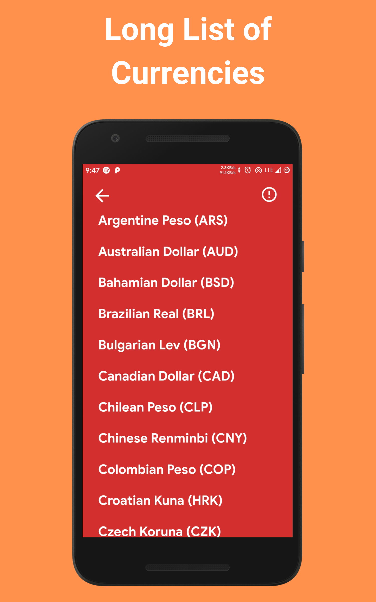

<p align="center">
  


<h1 align="center"> Currency Converter </h1> <br>
<p align="center">
   A free, open-source, materialistic UI designed, currency converter app.
</p>
<p align="center">
    
    
</p>
<p align="center">
  <a href="https://play.google.com/store/apps/details?id=com.akash.currency_converter"></a>
</p>
<p align="center">
    <br />
    &nbsp;
    &nbsp;
    &nbsp;
    &nbsp;
    &nbsp;
</p>

## 🎁 Features
* Easy Currency Conversion
* Quick On-Screen Keyboard Access
* Minimalistic and Material User Interface
* Offline Support
* Free From ADS!

## 🙌 Contribution 

* Fork this Project

* Git clone

* ``` cd Currency-Converter && flutter run ``` 

* make changes to code

* Pull request

## 💵 Support
> If you found this project helpful or you learned something from the source code and want to thank me, consider buying me a cup of :coffee:

[](https://www.paypal.me/RajpurohitAkash)

## 🐛 Bugs or Requests

If you encounter any problems feel free to open an [issue](https://github.com/AkashRajpurohit/Currency-Converter/issues/new). Pull requests are also welcome.

## 🙏 Credit 
Thanks to Oleg Frolov for his [UI Design Mockup](https://dribbble.com/shots/4816296-Stylish-Currency-Converter-iOS-app) for the inspiration.

## Visit My Portfolio
[Akash Rajpurohit](https://akashrajpurohit.cf)
