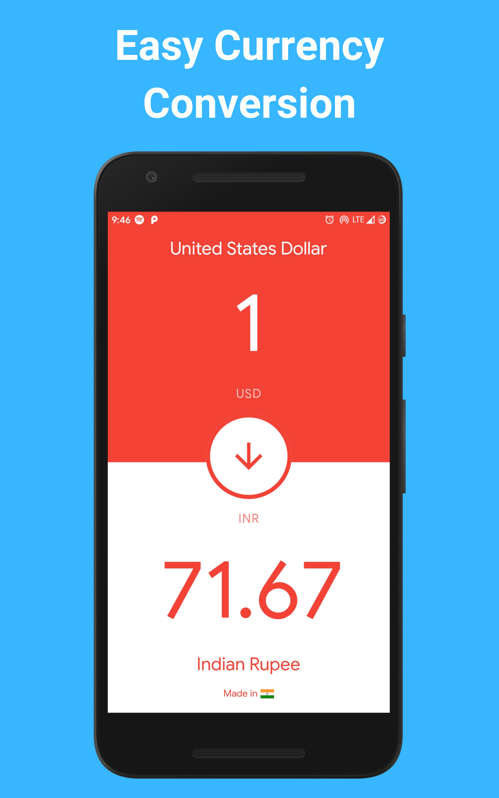
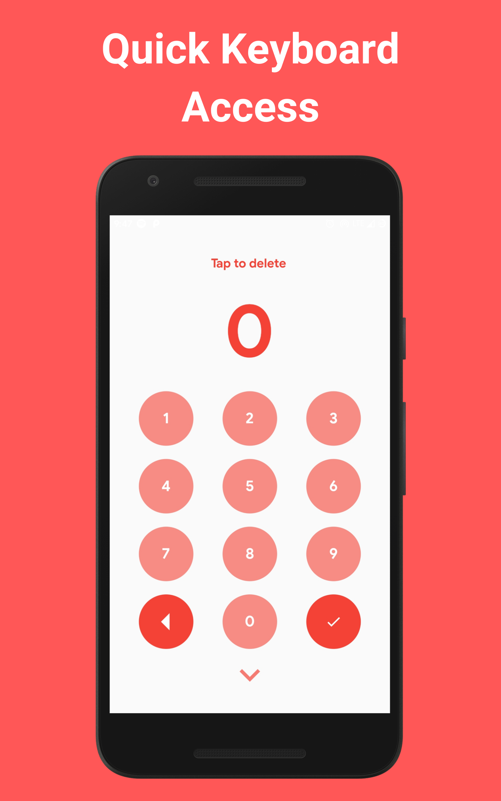

# Currency Converter

A Simple and Materialistic UI designed Flutter Application.

Design Inspiration - [Art by Oleg Frolov](https://dribbble.com/shots/4816296-Stylish-Currency-Converter-iOS-app)

## App Screenshots 

 
&nbsp;
&nbsp;
&nbsp;
&nbsp;
&nbsp;

## App Features
* Easy Currency Conversion
* Quick On-Screen Keyboard Access
* Minimalistic and Material User Interface
* Offline Support
* Free From ADS!

# Donate
> If you found this project helpful or you learned something from the source code and want to thank me, consider buying me a cup of :coffee:

# Bugs or Requests

If you encounter any problems feel free to open an [issue](https://github.com/AkashRajpurohit/Currency-Converter/issues/new). Pull requests are also welcome.

## Visit My Portfolio
[Akash Rajpurohit](https://akashrajpurohit.cf)
